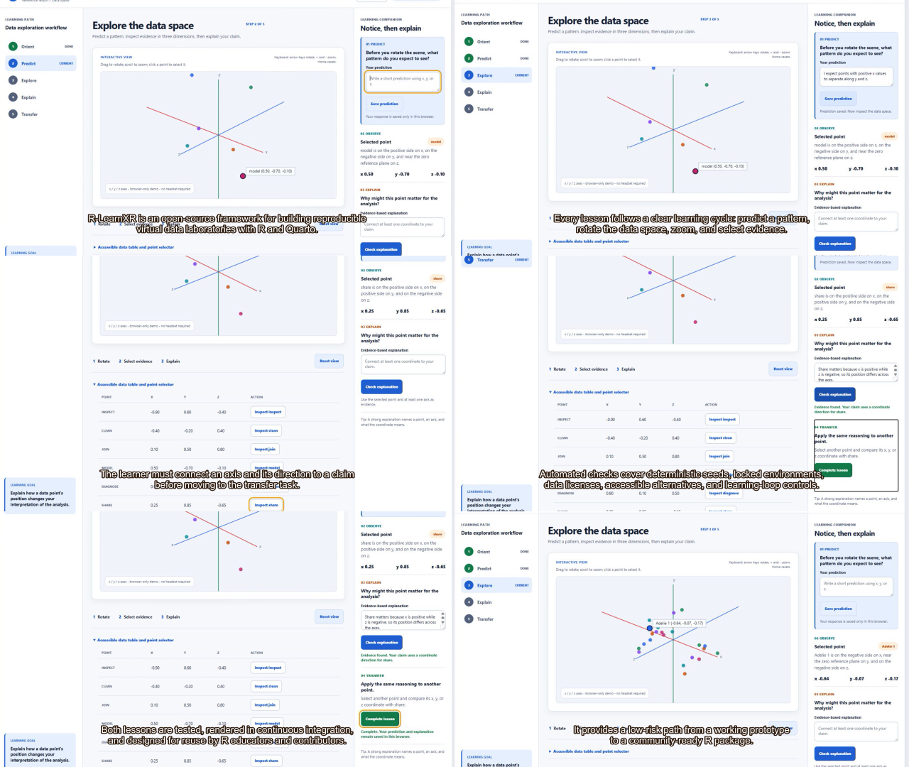
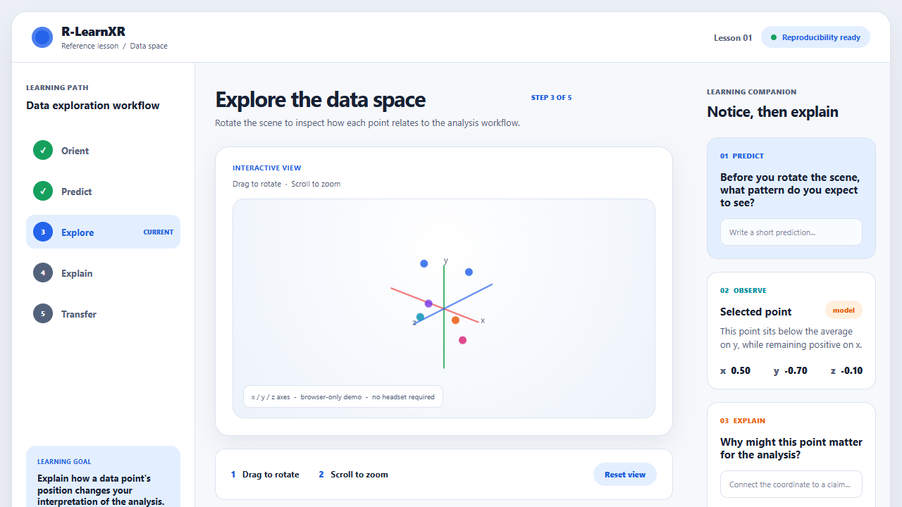
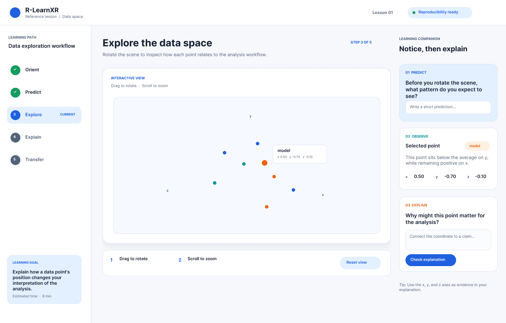

# R-LearnXR MVP

R-LearnXR is an open-source prototype for reproducible, browser-based 3D lessons built around R and Quarto. The MVP treats 3D/XR as an optional presentation layer. The core deliverable is a reusable R package that scaffolds lessons, creates a self-contained scene from a data frame, and checks basic reproducibility conditions.

## Grant demo

[](output/demo/rlearnxr-demo-en.mp4)

[Watch the 103-second English narrated and captioned demo](output/demo/rlearnxr-demo-en.mp4) or download the [English captions](output/demo/rlearnxr-demo-en.srt). The narration is AI-generated with ElevenLabs using the voice `Alice — Clear, Engaging Educator`.

Grant preparation materials:

- [Application preparation checklist](grant/application-prep.md)
- [ISC proposal draft](grant/isc-proposal-draft.md)
- [Team and budget decisions](grant/team-budget-checklist.md)
- [Grant-readiness scorecard](GRANT_READINESS.md)
- [Community validation status](community/validation-status.md)

## What works now

- `scaffold_lesson()` creates a small Quarto lesson project.
- `render_scene()` creates `scene/index.html` and `scene/points.json` from three numeric columns.
- The complete learner loop supports prediction, 3D exploration, evidence-based explanation, feedback, transfer, and completion.
- Pointer, keyboard, mobile, and accessible data-table paths expose the same analytical evidence.
- `check_lesson()` writes a Markdown report, session information, and generated-artifact hashes.
- `examples/lesson/` is the contributor-training lesson; `examples/penguin-pca/` is the authentic analysis lesson.
- GitHub Actions checks the R package, rebuilds both lessons, renders Quarto, and uploads the reports.

## Visual preview



## Figma UI reference

The Explore lesson interface was refined in [Figma](https://www.figma.com/design/jZ0W2ieUoSRwZtrMUKru8g) before being translated back into the browser demo.



## Run the MVP

From this directory, run:

```r
source("R/utils.R")
source("R/zzz.R")
source("R/render_scene.R")
source("R/scaffold_lesson.R")
source("R/check_lesson.R")
check_lesson("examples/lesson")
```

Open `examples/lesson/scene/index.html` in a browser. In a Quarto-enabled environment, run `quarto render examples/lesson` to render the lesson page.

Build and check every lesson from the repository root:

```powershell
Rscript scripts/build_all_lessons.R
Rscript scripts/check_all_lessons.R
quarto render examples/lesson
quarto render examples/penguin-pca
```

Contributor onboarding starts in [CONTRIBUTING.md](CONTRIBUTING.md). The authoring, accessibility, pilot, and roadmap documents turn the MVP into reusable community infrastructure rather than a one-off demonstration.

## Scope boundary

This MVP intentionally does not include a native headset application, multiplayer networking, an LMS, or a general-purpose 3D grammar for every R plot. Those are future extensions, not release criteria for the first grant-sized milestone.

## License

MIT. Educational content and future lesson datasets should carry their own explicit open licenses.

## Development QA rule

Every feature change should include both code verification and a visual artifact: run the R smoke/package checks, open the relevant browser lesson, save a screenshot under `output/playwright/`, and inspect the screenshot before handoff.
