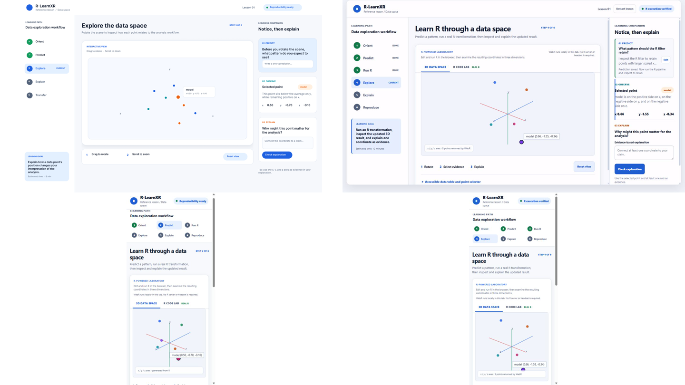
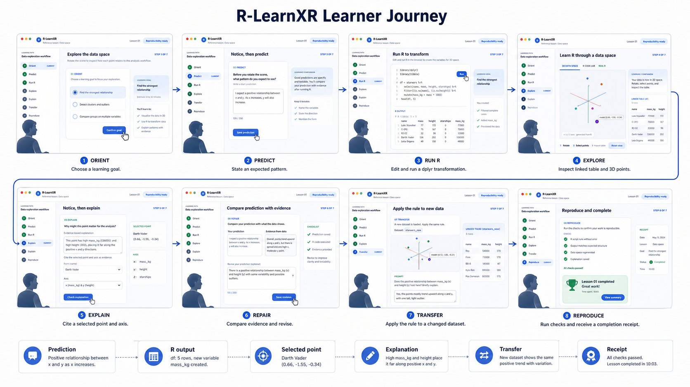
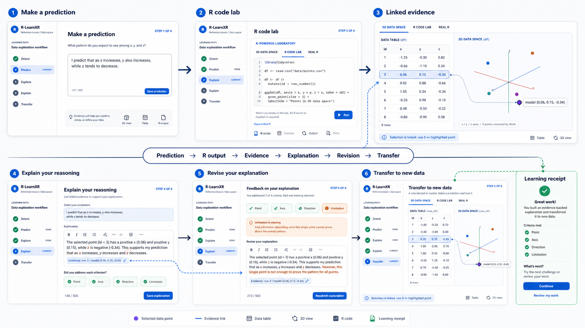

# R-LearnXR 학습경험 스토리보드 v0.2

## 1. 경험의 중심 문장

학습자는 정답 그래프를 구경하는 사람이 아니다. 학습자는 분석 결과를 먼저 예측하고, 실제 R 코드를 실행해 증거를 만들고, 코드·표·3D 공간을 연결해 해석한 뒤, 새로운 사례에 같은 추론을 적용하고 재현 가능한 결과물을 남긴다.

```text
모듈 선택 -> 맥락 이해 -> 예측 -> 실제 R 실행 -> 결과 검증
                                      |
                                      v
완료/다음 모듈 <- 재현성 저장 <- 전이 <- 설명 <- 표/3D 증거 탐색
```

3D/XR은 분석 증거를 탐색하는 선택적 표현이다. 학습목표는 R 분석, 통계적 추론, 증거 기반 설명, 전이, 재현성이다.

현재 구현 화면을 기준으로 한 시각 참조:



### 상세 시각 스토리보드

아래 첫 이미지는 모듈 진입부터 재현성 영수증까지의 전체 학습 여정을 보여준다. 각 화면은 단순한 페이지 전환이 아니라 학습자가 남겨야 하는 증거의 누적 단계다.



두 번째 이미지는 이 프로젝트의 핵심 학습 루프를 확대한다. 예측, R 실행 결과, 선택한 행과 3D 점, 설명, 기준별 피드백, 수정, 새 데이터 전이가 하나의 연결된 경험으로 작동해야 한다.



이미지의 화면은 목표 상태를 나타낸다. 2026-08-20 구현 검증에서 `Orient` 응답, 설명의 `Limitation` 기준과 `Repair`, 실제 `Transfer` 응답, 재현성 영수증, course home과 lesson 간 진행상태 동기화를 모두 완료했다.

## 2. 기준 페르소나와 학습 상황

### 주 학습자: Maya

- 대학원 입문 수준의 교육학 또는 데이터과학 학습자
- R에서 객체 할당과 데이터 프레임을 본 적은 있지만 분석 결과를 말로 설명하는 데 익숙하지 않음
- 그래프를 보고 인상을 말할 수는 있으나, 특정 행·좌표·코드와 주장을 연결하는 연습이 필요함
- 노트북 브라우저를 사용하며 헤드셋은 없음
- 목표: 10분 안에 작은 R 변환을 실행하고, 한 좌표를 증거로 사용하고, 결과를 재현 가능한 파일로 저장하기

### 사용 맥락

- 첫 모듈: `Make a data claim`
- 자료: 공개된 6행 synthetic dataset
- 핵심 계약: `scene <- data.frame(label, x, y, z)`
- 개인정보: 입력과 진행상태는 브라우저 로컬에 저장
- 필수 경로: 브라우저와 키보드
- 대체 경로: semantic table과 텍스트 설명

## 3. 학습성과

학습을 마치면 Maya는 다음을 수행할 수 있다.

1. 한 행이 무엇을 나타내는지, `label`과 `x`, `y`, `z`의 역할이 무엇인지 설명한다.
2. R 필터 또는 변환의 결과를 실행 전에 예측한다.
3. 실제 R 코드를 실행하고 반환된 `scene` 데이터 프레임의 유효성을 확인한다.
4. 한 점의 축과 좌표를 사용해 주장을 설명하고 한계를 밝힌다.
5. 다른 점이나 필터 규칙에 같은 추론을 적용한다.
6. R 코드, Quarto 문서, learning receipt를 저장하고 seed, runtime, row count, hash를 확인한다.

## 4. 10분 골든패스 요약

| 시간 | 장면 | 학습자 질문 | 핵심 행동 | 완료 증거 |
|---|---|---|---|---|
| 00:00-00:40 | 0. 모듈 선택 | 무엇을 배우는가? | Course home에서 `Make a data claim` 열기 | 선택한 모듈이 local resume에 기록됨 |
| 00:40-01:20 | 1. Orient | 한 행과 네 열은 무엇인가? | 목표와 scene contract 확인 | 행과 변수의 의미를 구분함 |
| 01:20-02:10 | 2. Predict | 필터 후 어떤 점이 남을까? | 좌표 언어로 예측 입력·저장 | prediction text |
| 02:10-03:00 | 3. Read the pipeline | R 코드가 장면을 어떻게 만드는가? | create, scale, subset 세 단계 확인 | 코드-데이터-좌표 매핑 |
| 03:00-04:10 | 4. Run R | 내 예측과 결과가 일치하는가? | `Run R & update 3D` 실행 | WebR runtime, seed, rows, hash |
| 04:10-05:30 | 5. Explore evidence | 어떤 점이 주장을 뒷받침하는가? | 3D 또는 table에서 점 선택 | selected point와 x/y/z |
| 05:30-06:40 | 6. Explain | 좌표가 왜 증거인가? | claim-evidence-limitation 문장 작성 | explanation text |
| 06:40-07:20 | 7. Repair | 내 설명에서 빠진 것은 무엇인가? | 피드백을 보고 점·축·방향·한계 보완 | explanation check 통과 |
| 07:20-08:30 | 8. Transfer | 다른 점에서도 같은 추론이 성립하는가? | 두 번째 점 또는 새 필터와 비교 | transfer response |
| 08:30-09:30 | 9. Reproduce | 다른 사람이 이 결과를 다시 만들 수 있는가? | `.R`, `.qmd`, receipt 다운로드 | 세 개의 learner-owned artifacts |
| 09:30-10:00 | 10. Complete | 무엇을 배웠고 다음은 무엇인가? | lesson 완료, course home 복귀 | completed receipt와 다음 모듈 제안 |

## 5. 장면별 상세 스토리보드

### 장면 0. Course home에서 모듈 선택

**화면**

- `examples/index.html`
- `What you will be able to do`, `Your local progress`, `Module library`
- 모듈 카드: `Make a data claim`, Beginner, 10 min

**학습자 행동**

1. 전체 성과를 읽는다.
2. 필요하면 Statistics, Learning analytics, EDM 필터를 사용한다.
3. `Open module`을 누른다.

**시스템 반응**

- 마지막으로 연 모듈을 브라우저 로컬에 기록한다.
- 계정이나 업로드 없이 lesson으로 이동한다.

**설계 의도**

- 기술보다 학습성과를 먼저 보여준다.
- learner-facing analytics는 진행상태를 보여주는 데서 끝나지 않고 다음 행동인 `Resume` 또는 `Open module`로 연결된다.

**접근성 경로**

- `Skip to course modules` 링크
- 키보드로 필터와 module card 접근
- progress는 텍스트로도 제공

### 장면 1. Orient: 데이터와 학습목표 이해

**화면**

- 왼쪽 learning path
- `Learning goal`: Run an R transformation, inspect the updated 3D result, and explain one coordinate as evidence.
- `R -> 3D contract`: `scene <- data.frame(label, x, y, z)`

**학습자 행동**

- “한 행은 한 관측치이고, `label`은 점의 이름이며, `x`, `y`, `z`는 좌표다”라는 짧은 orient response를 완성한다.

**시스템 반응**

- 정답을 바로 공개하지 않고 `label`과 numeric axes를 구별했는지 확인한다.
- 통과하면 Predict로 이동한다.

**학습증거**

- `row_meaning`
- `identifier_column`
- `coordinate_columns`

**구현 상태**

- 학습자가 행, 관측치, `label`, 좌표축의 의미를 직접 입력해야 통과한다.
- 응답은 로컬에 저장되며 `Edit`으로 다시 수정할 수 있다.

### 장면 2. Predict: 실행 전 가설 만들기

**화면**

- companion의 `01 PREDICT`
- 질문: `What pattern should the R filter retain?`
- 입력: `Your prediction`

**학습자 행동**

- 예: “I predict that points with positive x and negative y will remain.”
- `Save prediction`을 누른다.

**시스템 반응**

- 응답이 이 브라우저에만 저장됨을 알린다.
- R 결과는 아직 공개하지 않는다.
- prediction summary와 `Edit` 경로를 제공한다.

**피드백 기준**

- 최소 한 축을 언급함
- 방향 또는 threshold를 언급함
- 결과가 반증 가능함

### 장면 3. R pipeline 읽기

**화면**

- `R CODE LAB · REAL R`
- `Explain this R pipeline`
- 세 단계: create data, `scale()`, `subset()`
- editable `lesson-analysis.R`

**학습자 행동**

1. `scene`의 네 필수 열을 확인한다.
2. filter line을 찾는다.
3. prediction과 filter rule이 같은 의미인지 점검한다.

**시스템 반응**

- 코드의 각 단계와 장면 변화를 연결한다.
- 초보자에게는 starter code를 유지하고, 숙련자는 threshold를 수정할 수 있다.

**설계 의도**

- code, table, scene을 별도 자료로 제시하지 않고 같은 분석 객체의 세 표현으로 가르친다.

### 장면 4. 실제 R 실행과 결과 검증

**화면**

- 버튼: `Run R & update 3D`
- `R console`
- `Evidence reveal`: Before R / After R
- browser checks: seed, valid scene, finite axes, synchronized scene

**학습자 행동**

- R 코드를 실행한다.
- 반환 행 수와 제거된 행 수를 prediction과 비교한다.

**성공 반응**

- WebR runtime, seed, rows, artifact hash를 표시한다.
- 네 browser checks를 `PASS`로 바꾼다.
- `View updated 3D space`를 제공한다.

**오류 반응**

- 먼저 plain-language repair를 보여준다.
- 기술적 R console은 숨기지 않는다.
- 유효한 `label`, `x`, `y`, `z`와 최소 3개의 finite observations 조건을 알려준다.

**학습증거**

- 실행 코드
- WebR version과 R runtime
- seed
- returned row count
- artifact hash

### 장면 5. 연결된 표와 3D 공간에서 증거 탐색

**화면**

- `3D DATA SPACE`
- rotate, select evidence, explain controls
- `Accessible data table and point selector`
- companion의 `02 OBSERVE`

**학습자 행동**

- 3D 점을 클릭하거나 표 행을 선택한다.
- 필요하면 arrow keys로 회전하고 plus/minus로 확대한다.
- 선택한 점의 x, y, z 좌표를 읽는다.

**시스템 반응**

- 3D 선택, table row, `Selected point`, coordinate display를 동시에 갱신한다.
- Claim-Evidence-Code 연결에서 선택한 점과 실행한 filter line을 함께 보여준다.

**완료 조건**

- 학습자가 한 점을 선택함
- 선택한 점이 현재 R 결과에 포함됨
- 좌표가 텍스트와 table로도 읽힘

**접근성 경로**

- canvas 없이 semantic table만으로 같은 점을 선택할 수 있다.
- 색상이나 공간 시각만으로 답하도록 요구하지 않는다.

### 장면 6. 좌표를 사용해 설명하기

**화면**

- companion의 `03 EXPLAIN`
- 질문: `Why might this point matter for the analysis?`
- `Evidence-based explanation`

**학습자 행동**

- 문장 틀을 사용한다.

> Point ___ is ___ on the ___ axis at approximately ___, so I infer ___. This does not prove ___ because ___.

**시스템 반응**

- 선택한 point label과 최소 한 축을 사용했는지 확인한다.
- 좌표 방향 또는 값을 claim에 연결했는지 확인한다.
- limitation clause가 있는지 확인한다.

**구현 상태**

- Point, Axis, Direction, Limitation 네 기준을 독립적으로 확인하고 즉시 표시한다.
- Limitation이 빠지면 `Repair` 단계로 이동하며 통과 전에는 Transfer가 열리지 않는다.

### 장면 7. 피드백과 수리

**화면**

- explanation 아래 inline feedback
- 예: `Name the selected point`, `Add x, y, or z evidence`, `State what the coordinate cannot prove`

**학습자 행동**

- 자신의 설명을 수정하고 다시 확인한다.

**시스템 반응**

- 정답 문장을 대신 작성하지 않는다.
- 빠진 구성요소 하나를 구체적으로 알려준다.
- 통과하면 `04 TRANSFER`를 공개한다.

**설계 의도**

- feedback은 평가 결과가 아니라 다음 수정 행동을 제공한다.

### 장면 8. 새로운 사례로 전이

**화면**

- `04 TRANSFER`
- prompt: 다른 점을 선택하고 현재 evidence와 한 좌표를 비교한다.

**학습자 행동**

1. 다른 점을 선택한다.
2. 비교 문장을 작성한다.
3. 가능하면 threshold 하나를 바꾸고 결과를 다시 예측·실행한다.

**시스템 반응**

- 첫 점과 두 번째 점이 다른지 확인한다.
- 비교에 같은 축이 사용되었는지 확인한다.
- transfer response가 있어야 `Complete lesson`을 활성화한다.

**구현 상태**

- 첫 점과 다른 점을 선택한 뒤 point label, axis, 비교 방향을 포함한 응답을 작성해야 통과한다.
- 두 번째 점 선택만으로는 완료되지 않으며 transfer evidence가 receipt에 저장된다.

### 장면 9. 재현 가능한 결과물 저장

**화면**

- `Download analysis .R`
- `Download learner .qmd`
- `Download learning receipt`
- provenance ribbon

**학습자 행동**

- 세 파일의 역할을 확인하고 필요한 파일을 저장한다.
- receipt에서 prediction, explanation, selected evidence, code, seed, runtime, row count, hash를 확인한다.

**시스템 반응**

- 파일이 학습자 소유이며 자동 업로드되지 않음을 설명한다.
- AI adapter를 사용했더라도 private learner response가 전송되지 않았음을 표시한다.

**완료 증거**

- reproducible R source
- learner Quarto source
- portable learning receipt

### 장면 10. 완료와 다음 모듈

**화면**

- `Complete lesson`
- completion feedback
- course home의 local progress와 resume

**학습자 행동**

- 완료를 확정한다.
- 다음으로 `Find structure with PCA` 또는 track-specific module을 선택한다.

**시스템 반응**

- 완료 receipt를 생성한다.
- course home progress에 반영한다.
- 다음 모듈을 현재 학습근거와 연결해 추천한다.

**구현 상태**

- lesson completion이 course-level local progress receipt를 갱신한다.
- course home은 `Completed`, `Review module`, 완료 모듈 수, 다음 모듈을 즉시 반영한다.

## 6. 회복 경로 스토리보드

| 문제 상황 | 학습자가 보는 메시지 | 즉시 행동 | 학습은 어떻게 계속되는가 |
|---|---|---|---|
| WebR 첫 실행 지연 | `R engine · loading`과 first-run network 설명 | 잠시 대기하거나 static evidence 사용 | baseline scene, table, source export 유지 |
| WebR 네트워크 실패 | runtime을 불러오지 못했다는 plain-language 메시지 | table과 existing scene 탐색 | R 실행 성과는 미완료로 표시하고 재시도 가능 |
| R syntax error | 가장 가까운 수정 예와 technical console | 코드 한 줄 수정 후 rerun | prediction은 보존됨 |
| `scene` 열 누락 | 필요한 `label`, `x`, `y`, `z` 표시 | example contract 복원 | invalid output은 3D에 반영하지 않음 |
| 행이 3개 미만 | filter가 너무 많은 행을 제거했다는 설명 | threshold 완화 | 이전 successful scene 보존 |
| 3D 사용이 어려움 | semantic table 안내 | table row 선택 | 동일한 point evidence 생성 |
| 설명이 모호함 | 빠진 point, axis, value/direction, limitation 안내 | 설명 수정 | 통과 전 transfer를 열지 않음 |
| 새 점을 선택하지 않음 | first point와 다른 point 선택 안내 | table 또는 scene에서 다른 점 선택 | transfer response 후 완료 가능 |

## 7. 모듈별 스토리 변주

### R Foundations

- 예측: filter 후 남는 행
- R 행동: `subset()` threshold 변경
- 증거: 특정 point의 x/y/z
- 한계: 한 좌표만으로 원인이나 일반적 경향을 말할 수 없음
- 전이: 다른 threshold와 point 비교

### Penguin PCA

- 예측: 어느 species가 PC 공간에서 분리될지
- R 행동: `scale()`과 `prcomp()` 실행
- 증거: PC1, PC2, PC3 좌표와 선택된 penguin
- 한계: score 위치가 원인이나 species 본질을 의미하지 않음
- 전이: 다른 penguin 또는 scaling choice 비교

### Learning Analytics

- 예측: 어떤 event pattern이 descriptive difference를 보일지
- R 행동: event를 construct candidate로 집계
- 증거: attempts, time, explanation, transfer summary
- 한계: event는 motivation, ability, learning 자체가 아님
- 전이: 추가 evidence를 선택하고 reversible support action 제안

### Educational Data Mining

- 예측: scaling 또는 k 선택에 따라 pattern이 어떻게 바뀔지
- R 행동: feature engineering, clustering 또는 transparent classification
- 증거: cluster coordinate, confusion matrix, error case
- 한계: pattern은 diagnosis가 아니며 prediction은 intervention effect가 아님
- 전이: parameter sensitivity 또는 subgroup error 비교

## 8. UI와 데이터 이벤트 매핑

| 학습 단계 | 현재 UI | receipt 또는 상태 필드 | 구현 상태 |
|---|---|---|---|
| Orient | `orient-input`, `save-orient`, scene contract | `orientation` | 완료 |
| Predict | `prediction-input`, `save-prediction` | `prediction` | 완료, 모듈별 문항 세분화는 확장 항목 |
| Run R | `r-code-editor`, `run-r-code` | code, runtime, seed, rows, hash | 완료, attempt history는 연구 확장 항목 |
| Explore | canvas, `points-table`, `point-name`, coords | `selected_point` | 완료 |
| Explain | `explanation-input`, criteria chips | `explanation`, four criteria | 완료 |
| Repair | missing-criterion feedback | revised explanation | 완료 |
| Transfer | second point, `transfer-input`, `check-transfer` | transfer point and response | 완료 |
| Reproduce | download `.R`, `.qmd`, receipt | complete receipt | 완료, course progress 동기화 포함 |

## 9. 구현 결과와 다음 확장 백로그

### 완료: 스토리와 완료조건 일치

1. Orient response를 추가하고 진입 시 자동 `DONE`을 제거했다.
2. Transfer text field를 추가하고 두 번째 point 선택만으로 완료되지 않게 했다.
3. Explanation check에 limitation criterion과 Repair 단계를 추가했다.
4. lesson completion과 course home progress를 local receipt로 연결했다.

### P1: 표현 간 연결 강화

1. table row, 3D point, companion evidence, R code line을 같은 selection state로 연결한다.
2. run 전후 row count와 prediction을 한 화면에서 비교한다.
3. 각 모듈이 generic x/y/z 대신 실제 변수 의미를 표시하게 한다.

### P2: 확장 모듈

1. Penguin PCA storyboard를 같은 틀로 상세화한다.
2. Learning Analytics의 event-to-construct와 reversible action storyboard를 구현한다.
3. EDM의 sensitivity, error analysis, fairness storyboard를 구현한다.
4. AI Visual Brief는 optional branch로 별도 storyboard를 만든다.

## 10. 파일럿 관찰 포인트

- 학습자가 prediction 전에 R 결과를 보려 하는가?
- code, table, 3D 중 어느 표현에서 evidence를 처음 찾는가?
- 선택한 point와 explanation이 실제로 일치하는가?
- limitation prompt 없이도 과잉해석을 피하는가?
- transfer에서 단순 반복과 새로운 추론을 구분할 수 있는가?
- receipt의 seed, runtime, hash를 학습자가 설명할 수 있는가?
- table-only 또는 keyboard-only 경로로 같은 성과를 완료할 수 있는가?

## 11. 설계 근거

이 스토리보드는 현재 package manifest, course home, `inst/templates/scene.html`, reference lesson, curriculum map, accessibility baseline을 기준으로 작성했다. 표현 간 번역, self-explanation, virtual laboratory task design, learner-facing analytics sense-making에 관한 근거는 Ainsworth (1999, 2006), Potkonjak et al. (2016), Van Meter et al. (2017), Lachner et al. (2021), Makransky and Petersen (2021), Jivet et al. (2020), Paulsen and Lindsay (2024)을 사용했다.

상세 문헌 스캔은 내부 연구 메모에 보관하며, 공개 문서에는 기기별 절대 경로를 기록하지 않는다.
