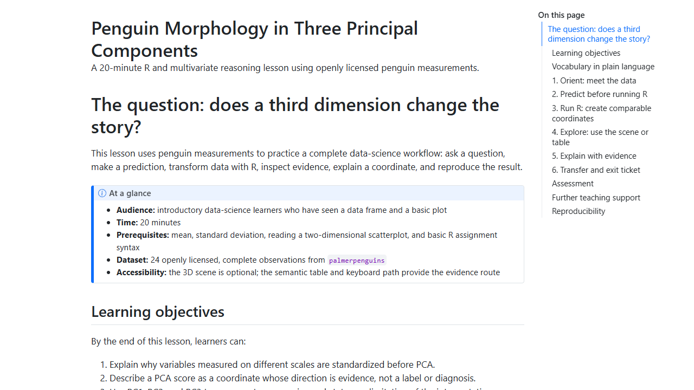
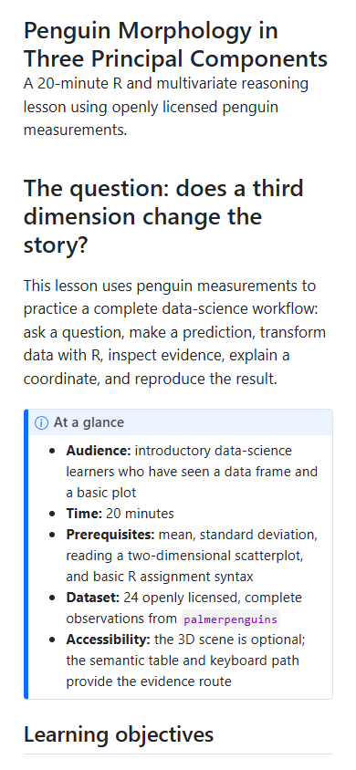

# Educational content implementation audit

Date: 2026-08-14  
Method: Quarto `--no-execute` structure render plus isolated Playwright screenshots of the rendered flagship lesson. R execution is covered by the hosted GitHub Actions matrix.

## Implemented content layers

- Statistics concept pathway: S01–S11 from data questions through reproducibility.
- LA application track: measurement, descriptive analytics, feedback/intervention, ethics, and learner agency.
- EDM application track: feature engineering, pattern discovery, transparent prediction, error analysis, and fairness.
- Beginner R micro-lessons: row/unit, filtering, standardization, and evidence sentences.
- Penguin PCA flagship: 20-minute learner-facing lesson with objectives, vocabulary, prediction, guided R, transfer, answer key, educator guide, rubric, accessible alternative, and extensions.
- Manifest education metadata and `education_content` strict check.

## Structure checks

| Check | Result |
|---|---|
| Lesson QMD structure render | PASS for all three reference lessons with `--no-execute` |
| Learning objectives in each lesson | PASS |
| Predict/explain/transfer prompts | PASS |
| Education metadata in reference manifests | PASS |
| Flagship lesson responsive content | PASS at 1440px and 390px |
| R execution and Quarto execution | Hosted CI gate |

## Screenshots

## Evidence boundary

The new modules are implemented as open educational content and authoring contracts. They do not claim that learners acquired the concepts or that LA/EDM interventions improve outcomes; those claims require the documented human pilot and a suitable evaluation design.
