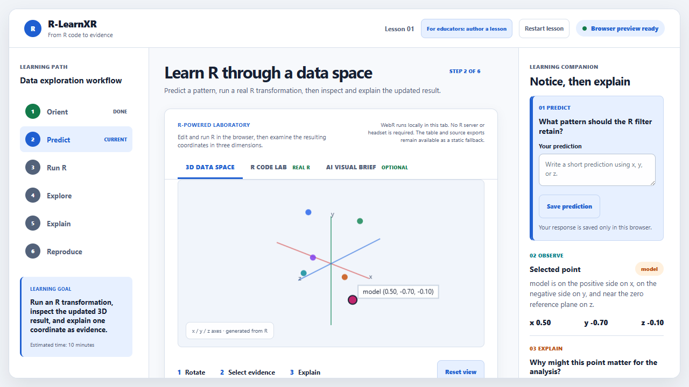

# R-LearnXR end-user rehearsal audit

Date: 2026-08-14
Public commit: `cfa47ea`
Public tag: [`v0.1.0-rc.4`](https://github.com/Educatian/rlearnxr/tree/v0.1.0-rc.4)

## Verdict

The Windows command-line equivalent of the RStudio onboarding flow is ready: a fresh GitHub clone and a fresh R library can install the package, load the exported API, render all three lessons, and pass strict checks. The public `main` branch contains the current validation workflow, while `v0.1.0-rc.4` remains the immutable release candidate. The browser smoke flow and offline fallback also pass on collision-resistant local ports.

The RStudio Desktop GUI itself was not run because it is not installed in this environment. GitHub Actions now provides hosted Linux, Windows, and macOS validation without local GUI control. Posit Cloud, corporate proxy, screen-reader, and human pilot runs remain external validation environments.

## Step-by-step evidence

| Step | User action | Result |
|---:|---|---|
| 1 | Run `scripts/diagnose_environment.R --strict` | PASS: R 4.6.1, Git, repository-local Quarto, remotes, renv, and palmerpenguins detected |
| 2 | Clone `https://github.com/Educatian/rlearnxr.git` from public `main` | PASS: public `main` resolves to `cfa47ea` |
| 3 | Build and install the cloned package into an empty library | PASS: package version `0.1.0` and all public validators load |
| 4 | Run `remotes::install_github("Educatian/rlearnxr")` without `ref` | PASS: default `main` now installs the current package |
| 5 | Run package smoke and testthat checks | PASS |
| 6 | Run strict checks for `lesson`, `penguin-pca`, and `mtcars-efficiency` | PASS for every check |
| 7 | Render all three Quarto lessons | PASS |
| 8 | Run the browser smoke flow | PASS: AI brief, mobile overflow, keyboard scene controls, and semantic table |
| 9 | Load the static scene, then block network before first Run R | PASS: static table remains available and the WebR failure is surfaced |

The remote counterpart is defined in [`docs/external-validation.md`](../../../docs/external-validation.md). It runs the package and lesson checks on GitHub-hosted Linux, Windows, and macOS runners, tests a clean public-main installation, and archives browser evidence. It does not claim human or assistive-technology validation.

The latest hosted validation run [`31824543142`](https://github.com/Educatian/rlearnxr/actions/runs/31824543142) completed successfully for commit `cfa47ea`. All seven jobs passed: public clean install, Linux/Windows/macOS package and lesson checks, browser interaction smoke, and Windows offline fallback smoke.

## Browser evidence




The screenshots show the updated R-LearnXR brand line, the R-powered laboratory, the optional AI brief, and the mobile layout. Screenshot evidence does not establish full WCAG conformance or learning effectiveness.

## Rehearsal commands

```r
install.packages("remotes")
remotes::install_github("Educatian/rlearnxr", upgrade = "never")
library(rlearnxr)
packageVersion("rlearnxr")
```

For authoring, clone the repository in RStudio with **File > New Project > Version Control > Git**, open `rlearnxr.Rproj`, run `renv::restore(prompt = FALSE)`, and then run `remotes::install_local(".")`. The complete path is documented in [`docs/end-user-quick-start.md`](../../../docs/end-user-quick-start.md).

## Remaining external gates

- RStudio Desktop GUI run on Windows with a human user
- macOS clean clone and install
- Posit Cloud or Workbench project clone and render
- Network-blocked WebR first-run recovery
- Corporate proxy and permission-denied recovery
- Independent screen-reader pass
- Novice learner and R educator pilot
