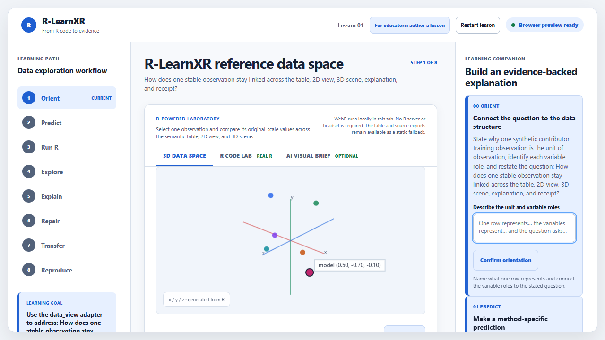
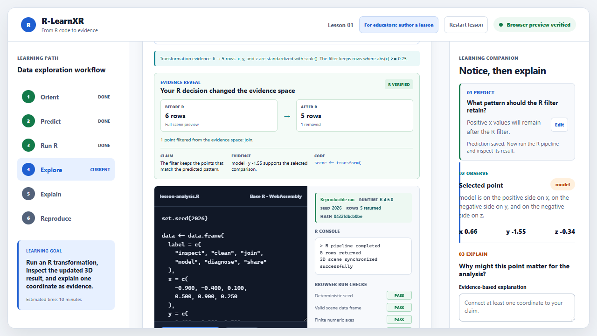
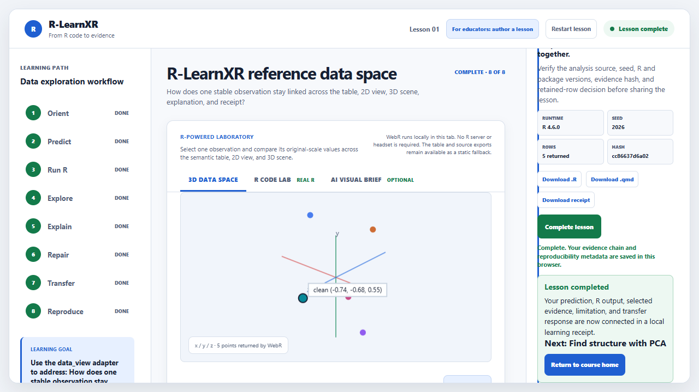
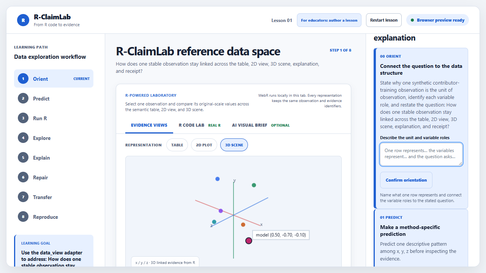

# R-LearnXR persona validation audit

Date: 2026-08-14

## Verdict

The automated proxies completed the learner journey and the accessibility-tree checks. The Posit Cloud scenario is represented by the successful GitHub-hosted Linux clean-room job. These results are useful regression evidence, but they are not a human learner pilot, a screen-reader conformance test, or a real Posit Cloud account run.

## Persona results

| Persona | Simulated task | Result | Evidence boundary |
|---|---|---|---|
| Novice learner | Predict, run R, inspect a point from the data table, explain one coordinate, compare another point, complete | PASS | Deterministic browser path; no human comprehension or time-on-task evidence |
| Screen-reader/keyboard user | Check landmarks, learning-path navigation, labels, live regions, canvas description, semantic table headers, and focusability | PASS | DOM/accessibility-tree proxy; no NVDA, VoiceOver, JAWS, or spoken-output test |
| Posit Cloud author | Install package into a temporary library, run strict checks for all lessons, render Quarto | PASS in hosted clean-room CI | Ubuntu hosted runner proxy; no authenticated Posit Cloud project |

## Learner flow evidence

1. Orient and Predict: the learner sees the six-step path and enters a falsifiable prediction.

   

2. Run R: the learner executes the editable pipeline and receives a verified transformation with deterministic seed, row count, hash, and four passing browser checks.

   

3. Explain and Transfer: the learner submits a coordinate-based claim, selects a different point, and unlocks completion.

   

## Accessibility-tree proxy evidence

The proxy checks that the scene exposes a main landmark, learning-path navigation, learning companion, tablist, described canvas, table caption, row and column headers, label targets, five or more live regions, and a keyboard-focusable canvas.



## Reproducibility

The browser proxy was executed with:

```powershell
powershell -NoProfile -ExecutionPolicy Bypass -File scripts/persona_validation.ps1 -StartServer
```

The clean-room Posit Cloud proxy is executed in `.github/workflows/check.yml` with:

```powershell
Rscript scripts/persona_validation.R
```

The latest full hosted validation run [`31827093537`](https://github.com/Educatian/rlearnxr/actions/runs/31827093537) passed the public install, Linux/Windows/macOS package and lesson checks, Quarto rendering, browser interaction, offline fallback, the synthetic learner/screen-reader proxy, and the Posit Cloud clean-room proxy.

## What remains human or account-dependent

- Five or more novice learners completing the protocol and reporting comprehension and usability.
- A qualified screen-reader user testing the complete task with spoken feedback and focus announcements.
- A real Posit Cloud or Workbench project clone, restore, render, and browser run.
- R educators or maintainers confirming authoring reuse intent.

Do not convert the proxy PASS values into grant claims about adoption, accessibility conformance, learning effectiveness, or community validation.
