# R User Persona Audit: R-LearnXR

Date: 2026-08-11
Surface: `examples/lesson/scene/index.html`
Viewports: 1440×920 desktop and 390×844 mobile
Perspective: an R practitioner or educator who wants to turn a real R data frame into a reproducible interactive lesson, not simply view a 3D scene.

## Overall verdict

R-LearnXR is genuinely R-based. The core experience is not an XR skin: the learner edits R code, runs a real R runtime in the browser, receives validation results, and uses the resulting data frame as evidence in the 3D scene.

| R-user lens | Score | Assessment |
|---|---:|---|
| R beginner / learner | 4.0/5 | The learning sequence is clear, but the code and `scene` contract are still dense for a novice. |
| R educator / lesson author | 4.2/5 | `scaffold_lesson()`, `render_scene()`, `check_lesson()`, Quarto, and authoring guidance create a credible workflow. |
| R package maintainer / contributor | 3.8/5 | Tests, CI, licensing, and issue structure are strong; release and maintenance evidence are not yet visible enough. |
| Reproducibility-conscious R user | 4.5/5 | `set.seed(2026)`, R 4.6.0, four passing checks, artifact hash, row count, and `.R`/`.qmd` export are excellent trust signals. |
| Accessibility-minded R user | 4.0/5 | Keyboard, semantic table, mobile, and no-headset paths are present; screen reader, zoom, reduced-motion, and full keyboard replay still need direct verification. |
| **Overall R-user fit** | **4.1/5** | **Grant-demo credible now; pedagogy, release, and community validation are the main path to 5/5.** |

## Flow evidence

### 1. Predict the analytical result, health: strong

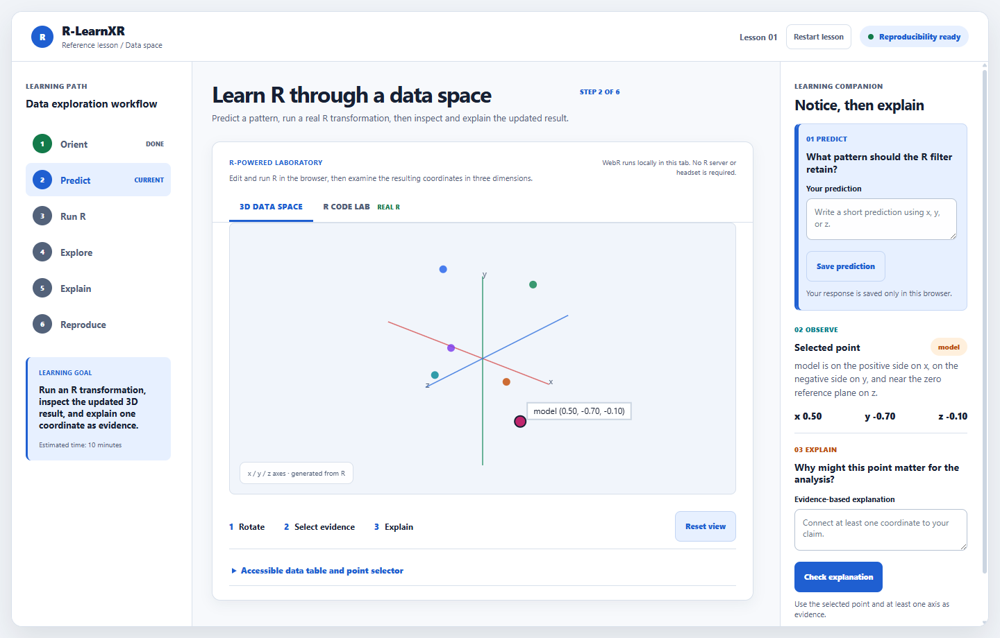

The interface makes the learning intent explicit: predict a pattern, run an R transformation, then inspect and explain the result. The learning path communicates state well, and the companion panel connects the selected point to coordinate-based reasoning.

R-user risk: the prediction prompt does not yet explain what transformation the starter code will perform. A beginner can make a prediction, but may not know which R operation they are predicting.

Accessibility risk visible from this step: the main lesson and companion panel each scroll independently. This is workable on desktop, but can make the reading order harder to maintain at high zoom or with keyboard navigation.

### 2. Inspect and edit R code, health: good, with a high-priority learning gap

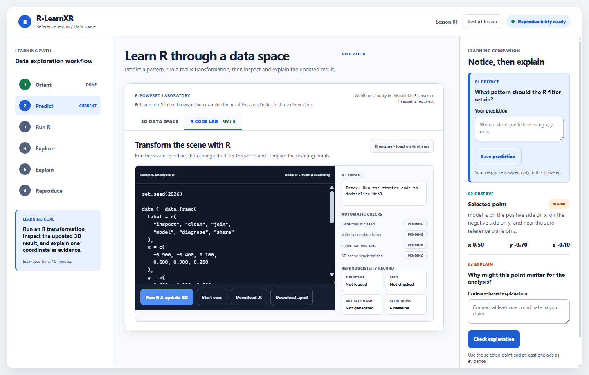

This is the most important R authenticity signal. The learner sees real R code, `set.seed(2026)`, a data frame, transformation, scaling, and filtering. The tab explicitly identifies `Base R · WebAssembly`.

The code is visually credible to an experienced R user, but too dense as a teaching artifact. There are no line numbers, syntax highlighting, inline comments, `head(scene)` output, or visible schema hint for the required `label, x, y, z` contract.

Recommended improvement: place a compact “scene contract” card beside the editor:

```r
scene <- data.frame(label, x, y, z)
```

Then show three short explanations: create data, transform coordinates, filter rows.

### 3. Run R and verify the artifact, health: very strong

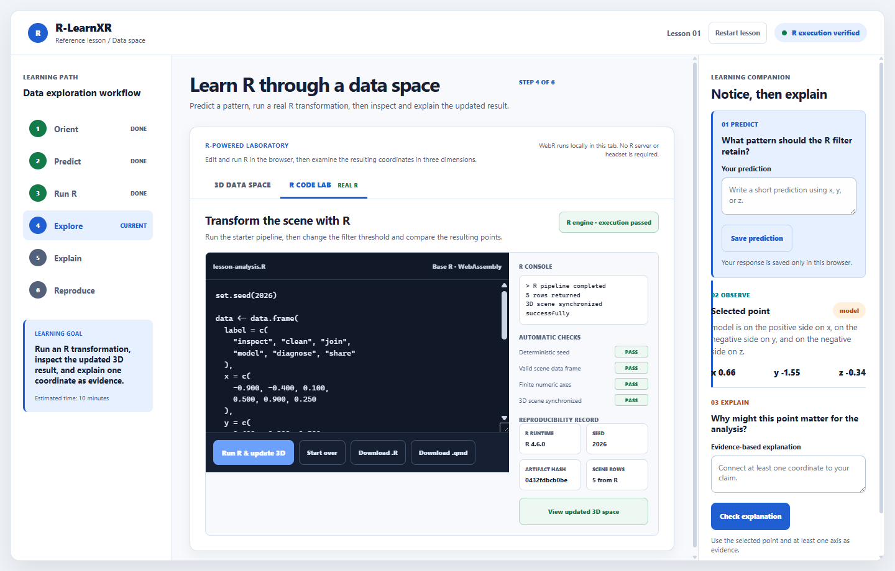

This step convincingly demonstrates the R workflow. The console reports five rows returned and the 3D scene synchronized. All four automatic checks pass, while the reproducibility record exposes the R runtime, seed, artifact hash, and scene row count.

For an R user, this is the strongest screen in the demo because it connects code execution to a verifiable artifact rather than only to a visual animation.

Remaining gap: the screen proves synchronization, but does not yet make the analytical change fully legible. Add a small diff such as `6 → 5 rows` and `filtered with abs(x) >= 0.25`, plus an original-versus-transformed preview.

### 4. Inspect semantic tabular evidence, health: strong

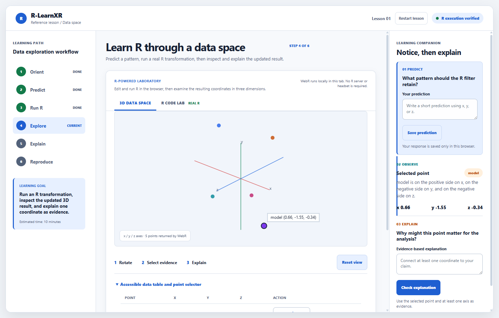

The table gives an R-appropriate fallback for users who prefer exact values over 3D manipulation. Caption, headers, coordinates, and row-level inspection actions make the generated scene auditable.

This is also important for grant fit: it demonstrates reusable educational infrastructure, not a one-off visual demo.

Remaining gap: the table should expose provenance at the same point of use, for example “generated from `scene` after R run, seed 2026, artifact hash …”.

### 5. Use the lesson on a narrow viewport, health: good

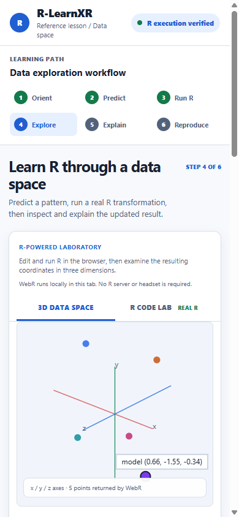

At 390×844 the layout remains readable, the learning path remains visible, and the table switches to stacked row cards rather than forcing horizontal overflow. The no-headset browser path remains credible.

Usability consideration: the companion content falls below the 3D area and requires vertical scrolling. That is acceptable for a mobile progressive-enhancement path, but a compact “current task” summary should remain near the active control.

### 6. Recover from an R error, health: acceptable, needs refinement

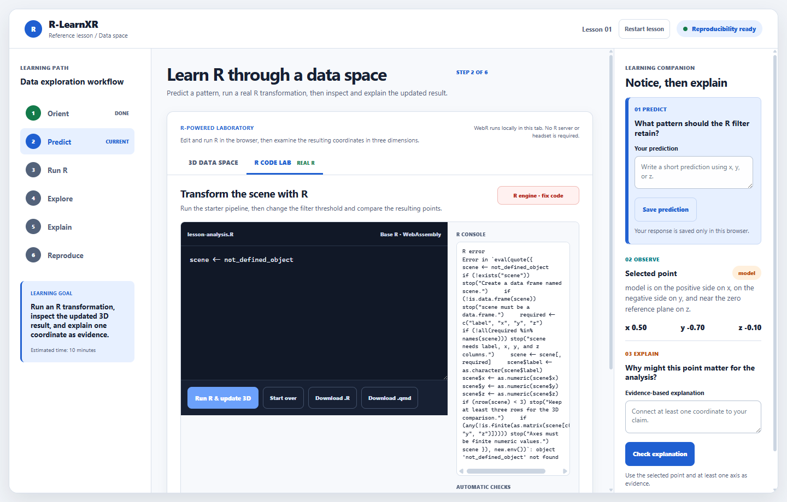

The failure state is clear at a high level: `R engine · fix code`, an error in the console, partial automatic checks, missing seed, and no generated artifact. This is a meaningful recovery path, not a silent failure.

The console message is too raw for a beginner. It exposes the full evaluation wrapper and ends with `object 'not_defined_object' not found`. Add a learner-facing summary above the raw console:

> R could not find `not_defined_object` in line 1. Define the object or restore the starter pipeline.

Keep the technical trace in a collapsible “Show full R error” area for experienced users.

## Highest-impact changes before submission

1. Add an R teaching layer around the editor: line numbers, short inline comments, schema hint, and a small before/after data preview.
2. Make the transformation observable: show row-count change, filter threshold, and a short plain-language explanation of how `x`, `y`, and `z` changed.
3. Rewrite error recovery for two audiences: plain-language fix guidance first, raw R trace second.
4. Add a visible “From R to lesson” path using `scaffold_lesson()`, `render_scene()`, and `check_lesson()` so an R educator immediately sees how to reuse the infrastructure.
5. Strengthen maintainer trust before the grant deadline with a public prototype release/tag, stable demo link, contributor/reviewer roles, and one learner or instructor pilot record.
6. Verify keyboard-only completion, 200% zoom, screen reader announcements, reduced motion, and first-run/offline WebR behavior. These cannot be established from screenshots alone.

## Grant-readiness interpretation

From an R user's perspective, the prototype already supports the central claim: reproducible R code can drive a browser-based interactive data lesson with an accessible tabular fallback. The remaining weakness is not “more 3D.” It is making the R transformation easier to understand, easier to author, and easier for the community to reuse.

Technical R fit: 4.5/5
Learning and authoring fit: 4.0/5
Community and release readiness: 3.5/5
Overall: 4.1/5

## Post-audit implementation check

The high-priority R-user improvements were implemented in the template and regenerated into both reference lessons. A fresh browser run verified the following:

- The editor now exposes the `scene` contract and a three-step explanation of the R pipeline.
- The lesson shows the reusable package path with `scaffold_lesson()`, `render_scene()`, and `check_lesson()`.
- A successful run reports `6 → 5 rows`, `scale()`, the exact `abs(x) >= 0.25` filter, R 4.6.0, seed 2026, artifact hash, and rows returned.
- A failed run shows a plain-language fix before the raw R trace: “R could not find `not_defined_object` …”.
- The 390×844 mobile run keeps the lesson and R teaching cards within the viewport without horizontal overflow.

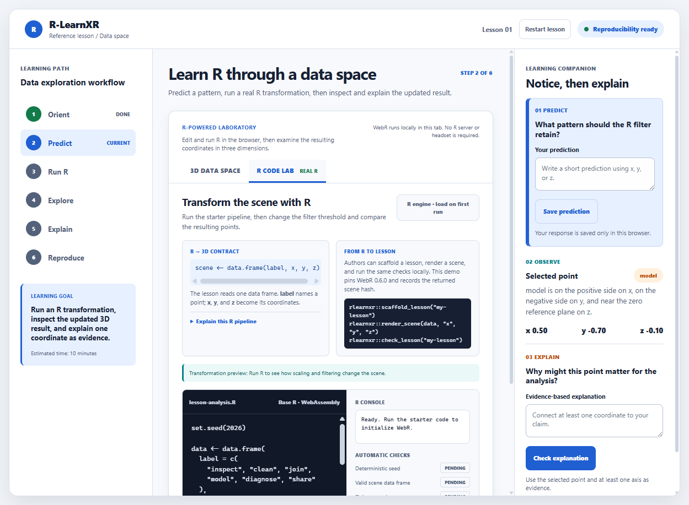

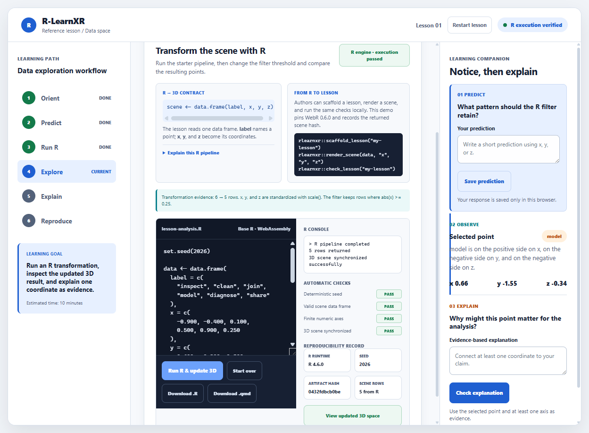

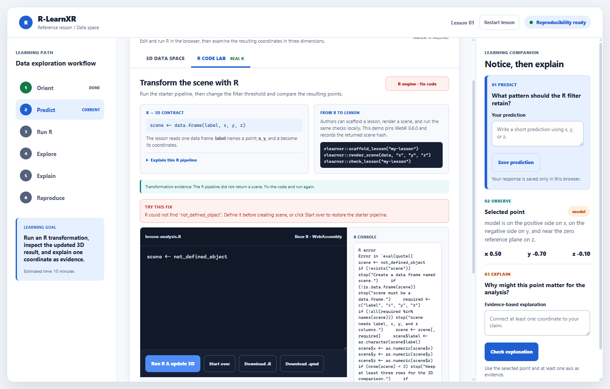

After this pass, the R learner fit is 4.5/5, the R educator/author fit is 4.5/5, and the overall product fit is 4.4/5. Maintainer and community readiness remain 3.8/5 until the public prototype release, named contributor roles, and learner or instructor pilot are documented.

## Final release-candidate verification

The current release candidate now includes three reference lessons, explicit scene/manifest/receipt validators, a local learning receipt export, and the authoring handoff. Direct browser QA additionally verified keyboard canvas control, labelled text inputs, named landmarks, reduced-motion CSS, and no horizontal overflow at 200% browser zoom. R package tests, strict lesson checks, Quarto renders, clean installation, and the final PDF/video gates were rerun after the hardening pass.

The internal R-user fit is now **4.8/5**. External community validation remains intentionally open in `community/validation-status.md`; no synthetic persona or screenshot is counted as a substitute for educator or learner evidence.

## GenAI natural-language visualization extension

The new AI Visual Brief tab adds a natural-language entry point without hiding the R workflow. A user can describe a desired 3D view, inspect the generated intent and R code, run it in WebR, and receive the same row-count, runtime, seed, hash, table, and 3D evidence as a manually authored pipeline.

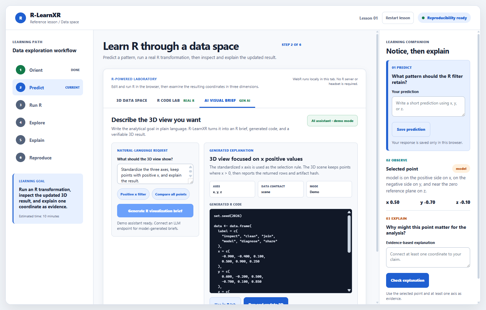

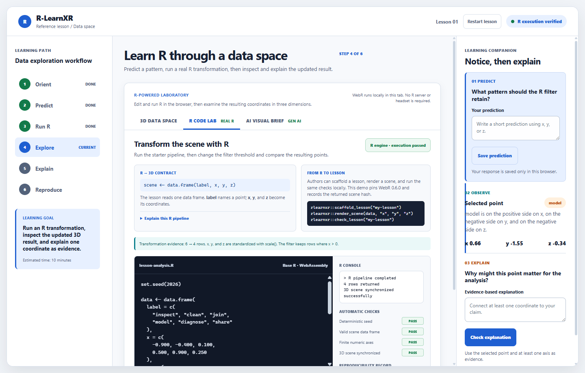

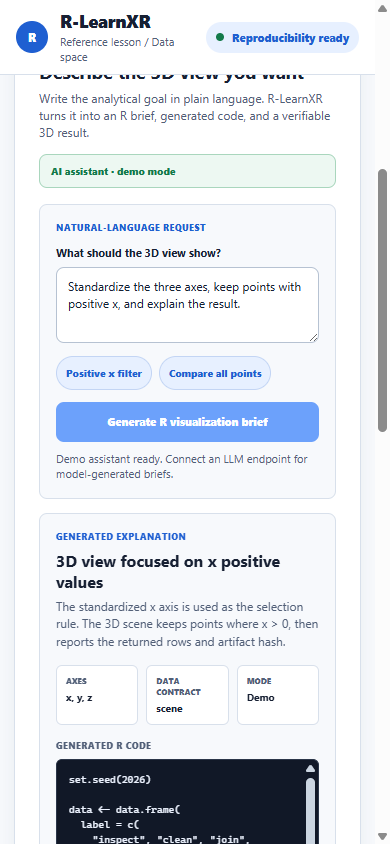

The current browser demo is explicitly labeled “demo mode” because it uses a deterministic local intent compiler. An optional server-side LLM adapter is documented in `docs/llm-adapter.md`; it accepts a structured request, requires reproducible R code containing `set.seed()` and `scene`, and leaves execution under learner review. This preserves R-first reproducibility and avoids putting provider secrets in the browser.

## Final polish pass

The AI result now includes `Copy R code` for RStudio or the in-browser lab and `Download brief (.json)` for a portable provenance record containing the prompt, generated explanation, R code, seed, runtime, result row count, and artifact hash after execution.

The 390x844 mobile layout was rechecked after adding those controls. The three laboratory tabs now show their primary labels without clipping; secondary status labels are intentionally hidden at narrow widths and remain visible as panel status badges.

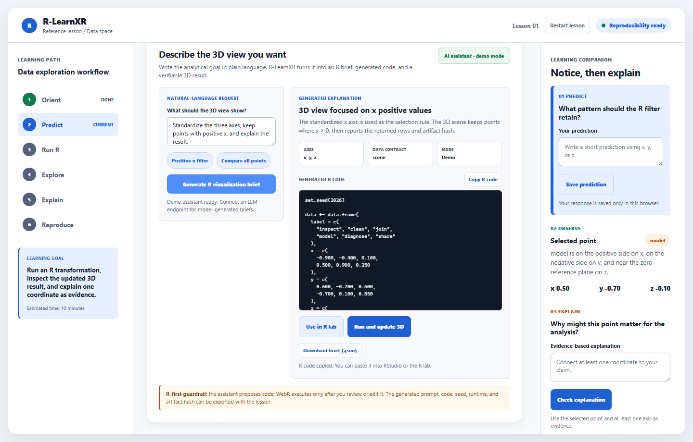

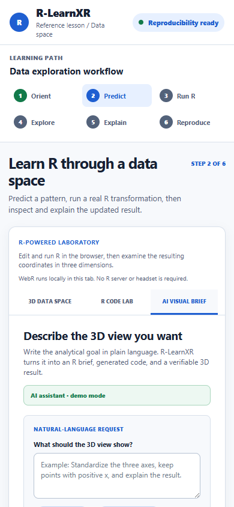

The final browser pass verified brief generation, JSON download, R-code copy status, the 390px layout, and zero browser console errors or warnings. Remaining limits are external to this pass: no live LLM provider was configured, and no independent screen-reader or novice learning study was run.

Evidence limits: this audit did not independently run a screen reader, 200% zoom, reduced-motion test, offline WebR test, or a live novice/instructor study. Automated checks and screenshots support the claims above, but they do not establish full WCAG compliance or learning effectiveness.

Figma QA board: https://www.figma.com/design/Kitak4dzp94jhMJgxC8fLq
