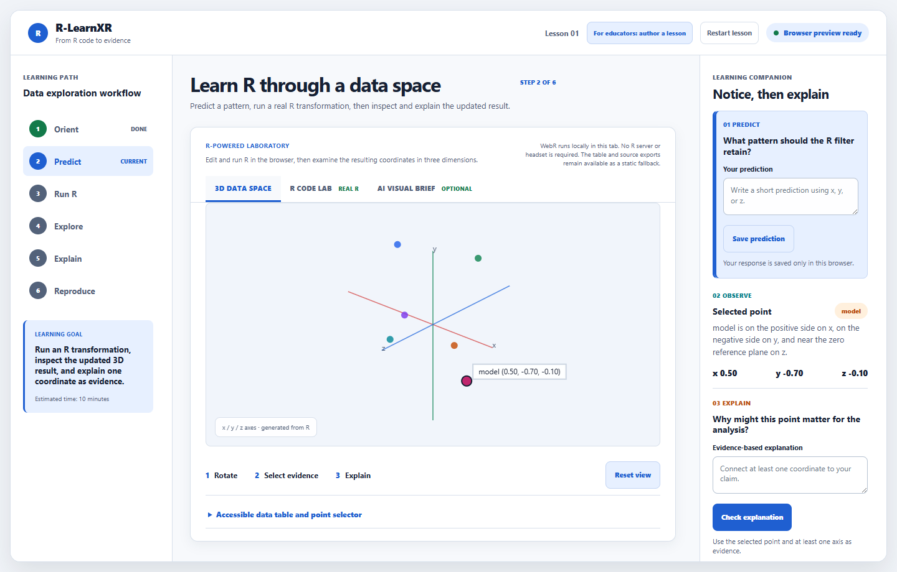
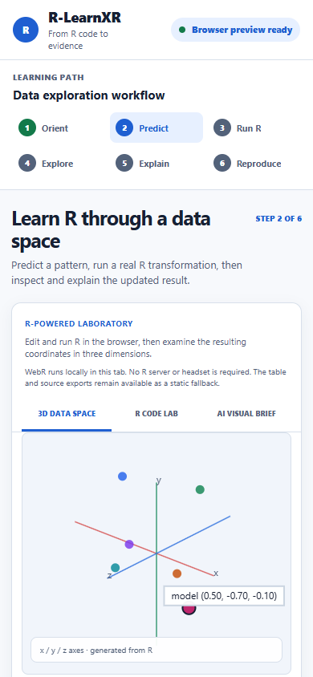
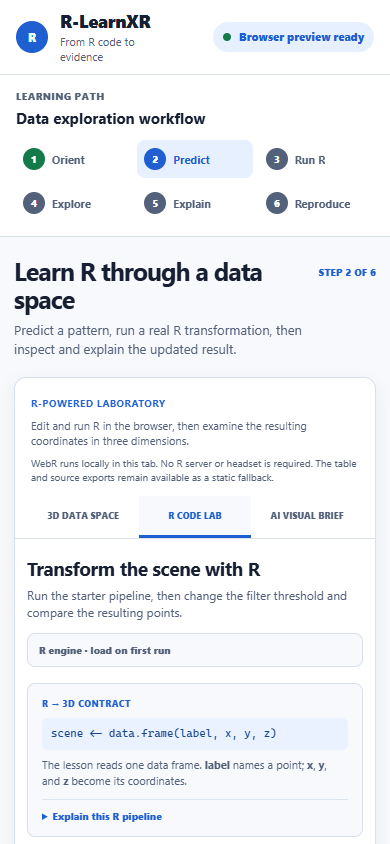
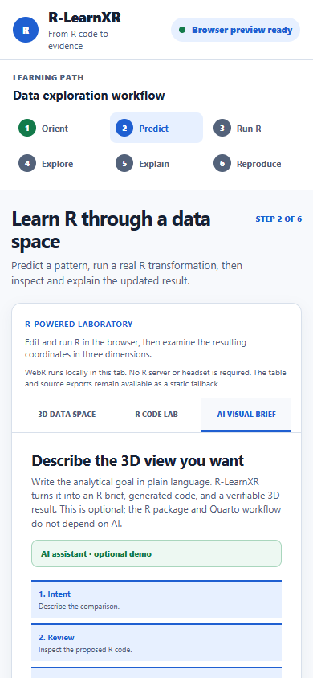
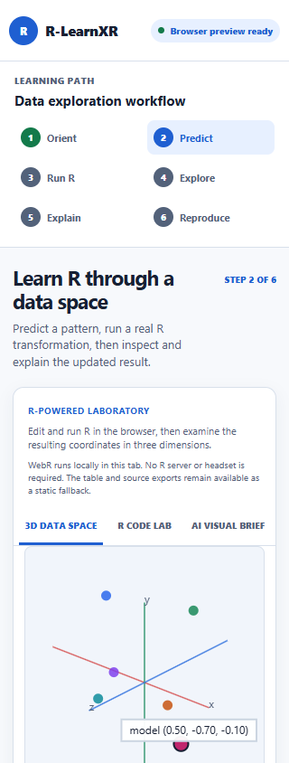

# R-LearnXR UI layout audit

Date: 2026-08-14  
Target: `http://127.0.0.1:8772/examples/lesson/scene/index.html`  
Method: isolated Playwright browser session; the user's active browser window was not controlled.

## Verdict

No reproducible panel overlap or horizontal clipping was found in the tested states. No production UI change was required from this audit.

## Scenarios checked

- Desktop layout: 1440 × 920.
- Responsive transitions: 1024 × 900 and 768 × 900.
- Narrow layouts: 560 × 900, 390 × 844, and 320 × 844.
- Laboratory tabs: 3D DATA SPACE, R CODE LAB, and AI VISUAL BRIEF.
- Long natural-language AI prompt and generated code result at 390px.
- Pairwise overlap checks for top-bar controls, learning-path steps, laboratory tabs, and title-row elements.
- Document `scrollWidth` against viewport width at every tested size.

## Results

| Check | Result |
|---|---|
| Horizontal overflow | PASS — `scrollWidth === viewport width` at all tested widths |
| Top-bar control overlap | PASS |
| Learning-path step overlap | PASS |
| Laboratory-tab overlap | PASS |
| Title/step indicator overlap | PASS |
| Long prompt/code boundary | PASS — no element extended beyond the viewport |

## Screenshots

## Evidence limit

This is an automated layout regression check. It does not replace visual inspection of the user's exact browser zoom/DPI state. If the active tab still appears broken, the most useful next evidence is one screenshot plus the browser zoom percentage and viewport width; the isolated run shows the current source does not reproduce the reported overlap.
